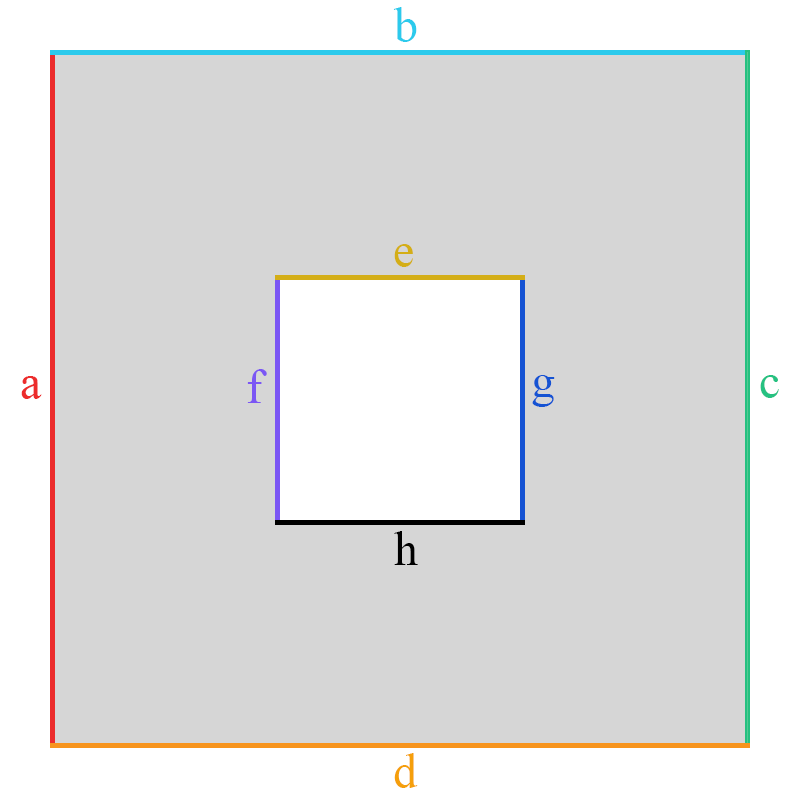

# SimpleFvm

The SimpleFvm library is a highly simplified finite-volume solver for modelling incompressible flows. It supports the solution of planar two-dimensional problems in a stationary setting.
The solver is based on staggered mesh.

**The solver is not intended for scientific research or industrial use.**


## Features
* two-dimentional planar problems
* stationary, incompressible fluid flows
* staggered mesh
* Semi-Implicit Method for Pressure Linked Equations (SIMPLE algorithm)
* supported boundary conditions:
  * static wall
  * tangentially moving wall
* saving results to .vtk file
* so far solver uses custom mesh file (maximum simlified)


## Limitations
* the maximum number of boundary surfaces in the computational domain is 25
* all the boundary surfaces must be named by any single letter, except letter "z". (It's reserved for interior cells)
* turbulent models are not supported
* the calculation stops after all iterations are completed (residual values are not considered)
* the solver supports only horizontal and vertical boundary conditions

## Custom Mesh File Discription
The solver uses custom mesh file (it's a temporary solution).
The mesh file is a plain text file where the letter "x" is taken as an interior cell (pressure cell) and the digit "0" is taken to specify gaps in a computational domain.    
As an example, you can see the mesh file corresponding to the simple computational domain with the gap inside. 

Сomputational domain:




Appropriate mesh file:
```
xxxxbxxxxxxxxxxxxxxxxxxxx
xxxxxxxxxxxxxxxxxxxxxxxxx
axxxxxxxxxxxexxxxxxxxxxxc
xxxxxxxx000000000xxxxxxxx
xxxxxxxx000000000xxxxxxxx
xxxxxxxf000000000gxxxxxxx
xxxxxxxx000000000xxxxxxxx
xxxxxxxx000000000xxxxxxxx
xxxxxxxxxxxxhxxxxxxxxxxxx
xxxxxxxxxxxxxxxxxxxxxxxxx
xxxxxxxxxdxxxxxxxxxxxxxxx
```

Setting the names of boundary surfaces should be done as in the example. The area of inner cells doesn't need to be named.

## Staggered Mesh Illustratation
Two-dimentional staggered mesh cell has a following look:


where:
* black is a pressure cell
* red is u-velocity component (horizontal direction) cell
* green is v-velocity component (vertical direction) cell
  
So, as an example, a simple square computational domain (4x4 interior cells) looks like this:


# Build
This software is built with Cmake.
```
git clone https://github.com/artvns/SimpleFvm.git
mkdir build 
cd build 
cmake ..  
cmake --build . -j <number of jobs>
```


# Installation
If using GCC or Clang compiler do the following
```
cd build 
make install
cd installDir           # Generated lib location.
```
If using MCVS compiler, you must set CMAKE_PREFIX_PATH first where the library will be installed and then perform the installation using IDE.


# Usage
The way of using the library is illustrated by an example of a simple planar two-dimensional problem. There are more examples in the project's folder [tests](https://github.com/artvns/SimpleFvm/tree/main/simplefvm/tests).

## Problem Description
There is a rectangular domain with fluid (water) which is bounded with walls and has a gap inside. The top wall of the domain (wall "b") moves tangentially and causes the movement of the fluid. The rest of the walls stay motionless. The problem is to figure out the motion picture of the fluid. The motion of fluid is stationary.


## Mesh Generating
In order to solve the problem, we need to create a mesh based on an existing domain.

```
xxxxbxxxxxxxxxxxxxxxxxxxxxx0000000
xxxxxxxxxxxxxxxxxxxxxxxxxxx0000000
xxxxxxxxxxxxxxxxxxxxxxxxxxx0000000
xxxxxxxxxxxxxxxxxxxxxxxxxxx0000000
axxxxxxxxxxxxxgxxxxxxxxxxxc0000000
xxxxxxxxxxxx00000xxxxxxxxxx0000000
xxxxxxxxxxxx00000xxxxxxxxxx0000000
xxxxxxxxxxxh00000ixxxxxxxxxxxxdxxx
xxxxxxxxxxxx00000xxxxxxxxxxxxxxxxx
xxxxxxxxxxxx00000xxxxxxxxxxxxxxxxe
xxxxxxxxxxxxxxjxxxxxxxxxxxxxxxxxxx
xxxxxxxxxxxxxxxxxxxxxxxxxxxxxxxxxx
xxxxxxxxxxxxxxxxxxxxxxxxxxxxxxxxxx
xxxxxxxxxxxxxxxxxxxxxxxxxxxxxxxxxx
xxxxfxxxxxxxxxxxxxxxxxxxxxxxxxxxxx
```

## Basic usage
After mesh file is being created it's time to use the library. The several steps should be followed:
* set size of the cells (it's temporary)
* load mesh
* set the solver's parameters
* set boundary conditions
* run calculation
* save results


```cpp
#include <cstddef>
#include <string>

#include "simplefvm/libQuadMeshSolver"

int main() {
    const std::string meshFileName_ = "meshFile";

    // Set the cell's size (for all mesh cells). Size dimention is meter.
    double dx_ = 0.01;
    double dy_ = 0.01;

    // Create solver and load mesh.
    sfvm::QmSolver fvmSolver_;
    fvmSolver_.loadMesh(meshFileName_, dx_, dy_);

    // Select calculation algorithm.
    sfvm::AlgorithmChooserModule algChooser_;
    algChooser_.select_SIMPLE();

    // Select calculation scheme.
    sfvm::SchemeChooserModule schemeChooserModule_;
    schemeChooserModule_.select_HYBRID();

    // Select system of linear algebraic equations solver.
    sfvm::SleSolverChooserModule sleSolverChooserModule_;
    sleSolverChooserModule_.select_EIGEN_SOLVER();

    // Set fluid properties.
    // Fluid: water
    // Dynamic viscosity, Pa*s: 0,001004
    // Density, kg/m^3: 998,0
    sfvm::FluidPropsModule fluidPropsModule_;
    fluidPropsModule_.setDynamicViscosity(0.001004);
    fluidPropsModule_.setDensity(998.0);

    // Set boundary conditions. Wall velocity dimention is meter per second.
    sfvm::PartTypeChooserModule partTypeChooserModule_;
    double wallVelocity_ = 0.01;
    partTypeChooserModule_.set_INTERIOR("z");
    partTypeChooserModule_.set_MOVING_WALL("b", wallVelocity_);
    partTypeChooserModule_.set_STATIC_WALL("a");
    partTypeChooserModule_.set_STATIC_WALL("c");
    partTypeChooserModule_.set_STATIC_WALL("d");
    partTypeChooserModule_.set_STATIC_WALL("e");
    partTypeChooserModule_.set_STATIC_WALL("f");
    partTypeChooserModule_.set_STATIC_WALL("g");

    // Set the way of displaying the results. (console/file or both)
    sfvm::ResidualsSettingsModule residualsSettingsModule_;
    // residualsSettingsModule_.selectConsoleOutput();
    residualsSettingsModule_.selectFileOutput("residualsFileName");

    // Pass the generated parameters to the solver.
    fvmSolver_.defineAlgorithm(algChooser_);
    fvmSolver_.defineScheme(schemeChooserModule_);
    fvmSolver_.defineSleSolver(sleSolverChooserModule_);
    fvmSolver_.defineFluidProperties(fluidPropsModule_);
    fvmSolver_.defineBoundaryConditions(partTypeChooserModule_);
    fvmSolver_.defineResidualsSettings(residualsSettingsModule_);

    // Run the calculation and save the results.
    size_t numberOfIterations_ = 500;
    fvmSolver_.startCalculation(numberOfIterations_);
    fvmSolver_.saveFileTxt("results_SimpleTextFile");
    fvmSolver_.saveFileVtk("results_VtkMeshFormat");

    return 0;
}
```
## Observing Results
The library provides two ways of saving results:
* in a .vtk file
* in a simple text file (do not use!)

It's recommended to use [ParaView](https://www.paraview.org/) for observing the results.    
    
Here is the result of calculation.


# Upcoming Changes
* add boundary conditions:
  * velocity inlet
  * pressure inlet
  * pressure outlet
* modify the solver to work with co-located mesh
* add an ability to deal with one of standart mesh formats


# Platforms
## Supported Operating Systems
* Linux
* Windows

## Supported Compilers
The library supports the standard C++11. It has been tested with the following compilers. 
* GCC 8.4.0
* Clang 10.0.0
* MSVC 2017+ (15.0)

## Build Systems
* CMake 3.11.2


# Dependencies
* [The Visualization Toolkit (VTK)](https://vtk.org/) version 8.2.0
* [Eigen](https://eigen.tuxfamily.org/) version 3.3.7
* [GoogleTest](https://google.github.io/googletest/)


# Gallery
Here we can see some samples of count results made by SimpleFvm library.


# License
This project is released under [MIT License](https://github.com/artvns/SimpleFvm/blob/main/LICENSE).
